# SWS304 – Assignment 04

## Prototype Pollution Labs

**Student Name:** Dupchu Wangmo

**Student ID:** 02230282

**Course:** SWS304 Advanced Web Security


# Lab 1 – Client-Side Prototype Pollution via Browser APIs

## Step 1 – Explore the Application and Find the Vulnerable JavaScript Code

### Figure 1a – DevTools Sources: JavaScript Reading URL Parameters

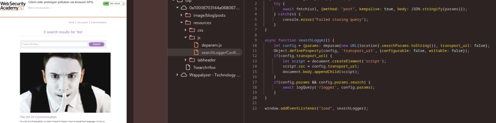

### What does the vulnerable code do?

From the web address, JavaScript grabs details and tucks them into a container shaped like an object. Without checking what those detail names actually are, it assigns them straight away. Since keys like `__proto__` slip through unchecked, someone with bad intent reshapes `Object.prototype`. Every object in the program then carries that change forward.

## Step 2 – Inject the Payload and Verify Pollution

### Payload Used

```text
?__proto__[testprop]=polluted
```

### Figure 1b – Console Showing Object.prototype Polluted

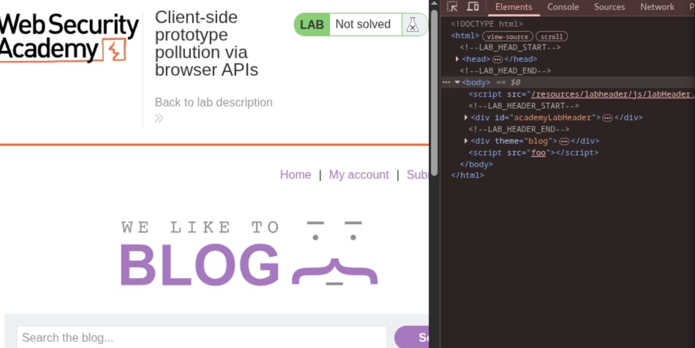

### Verification

```javascript
Object.prototype.testprop
```

Expected result:

```text
polluted
```

## Step 3 – Solve the Lab

### Final Payload URL

```text
[Insert actual payload used to solve the lab]
```

### Figure 1c – Lab Solved Confirmation

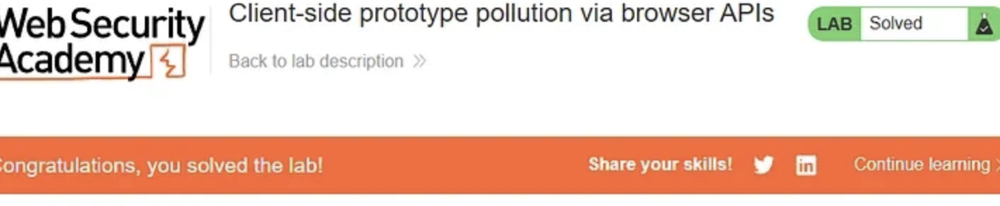

## Summary

This lab demonstrated a client-side prototype pollution vulnerability. User-controlled URL parameters were assigned to an object without proper validation, allowing the special `__proto__` property to modify `Object.prototype`. Because all JavaScript objects inherit from `Object.prototype`, the injected property became available across the entire application. In real-world applications, this vulnerability can lead to privilege escalation, application logic manipulation, and cross-site scripting attacks.


## Questions – Lab 1

### Question 1.1

Why does adding ?__proto__[x]=y to the URL cause Object.prototype to be modified?

Right there in the code, when JavaScript sees `__proto__`, it skips adding a regular key and reaches into the object’s blueprint. Because of that shift, whatever gets assigned ends up living inside `Object.prototype`. Now here’s where things spread - every standard object traces back to that same prototype. So the added property shows up everywhere, hanging on all objects born from that app.

### Question 1.2

Name ONE defence a developer could add to prevent this attack.

A developer should validate input keys and block dangerous properties such as `__proto__`, `constructor`, and `prototype`. This prevents user-controlled data from modifying the prototype chain and stops prototype pollution from occurring.


# Lab 2 – DOM XSS via Client-Side Prototype Pollution


## Step 1 – Find the Source and Sink

### Figure 2a – Pollution Source

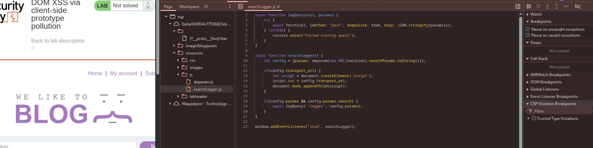

### Figure 2b – DOM Sink

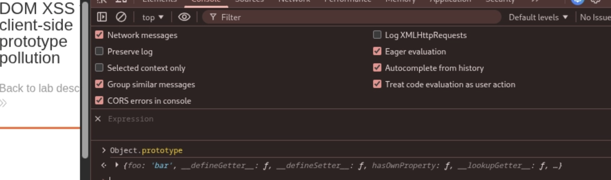

### Sink Property Identified

```text
[Insert sink property discovered in the lab]
```


## Step 2 – Fire the XSS

### Payload URL

```text
[Insert final XSS payload URL]
```

### Figure 2c – XSS Triggered

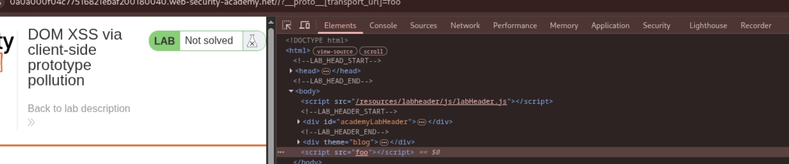

### Figure 2d – Lab Solved Confirmation

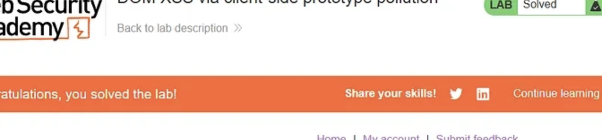


## Summary

This attack occurred in two stages. First, prototype pollution was used to inject a malicious value into `Object.prototype`. Second, a DOM sink retrieved the inherited property and inserted it into the page. Because the injected value contained JavaScript code, the browser executed it, resulting in a DOM-based XSS vulnerability.


## Questions – Lab 2

### Question 2.1

Why would injecting the XSS payload directly into the sink not work?

It doesn’t take what users type and plug it straight into the sink. What happens is, the sink pulls a value from an object’s property. When `Object.prototype` gets tampered with, that tainted property sneaks into the target object via inheritance. The result? That injected data runs inside the sink - never set there directly, yet still present. Hidden paths let it slip through.

### Question 2.2

Does adding DOMPurify fully fix the vulnerability?

No. Still, DOMPurify only cleans HTML to block XSS - it won’t touch prototype pollution. That flaw lives on in code handling untrusted object inputs. Watch out: unsafe prototype keys can slip right through if unchecked. Input validation becomes essential here, because cleaning markup doesn’t fix deeper structural risks. The danger stays put until devs actively reject harmful property names.


# Lab 3 – Privilege Escalation via Server-Side Prototype Pollution


## Step 1 – Intercept the JSON Request

### Figure 3a – Original JSON Request

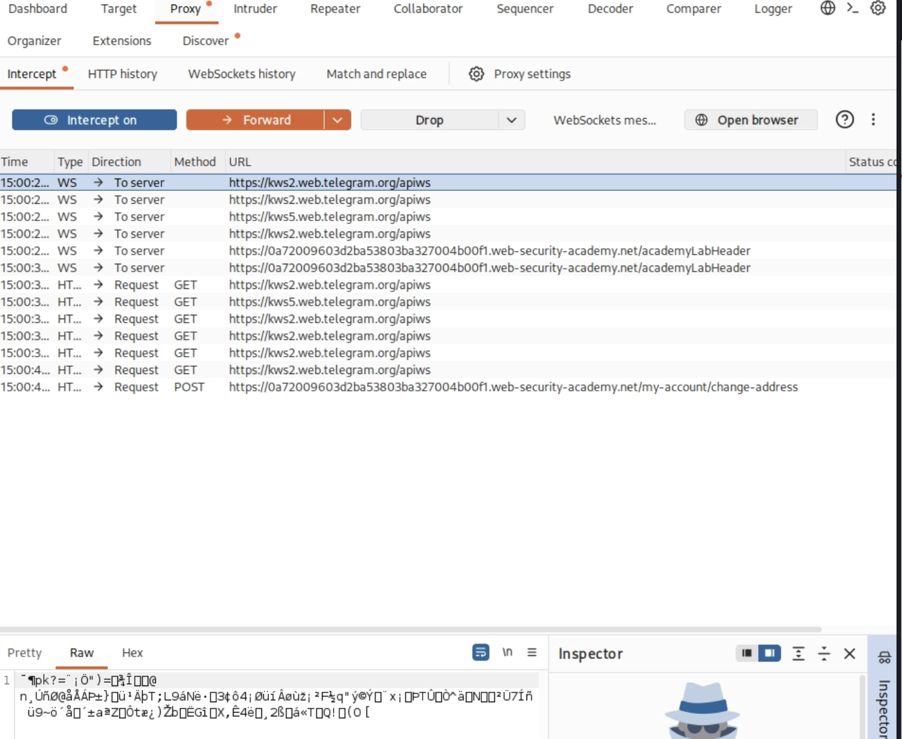

## Step 2 – Inject the **proto** Payload

### Payload Used

```json
{
  "__proto__": {
    "isAdmin": true
  }
}
```

### Figure 3b and 3c – Modified Request

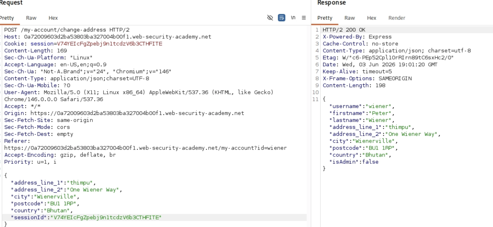

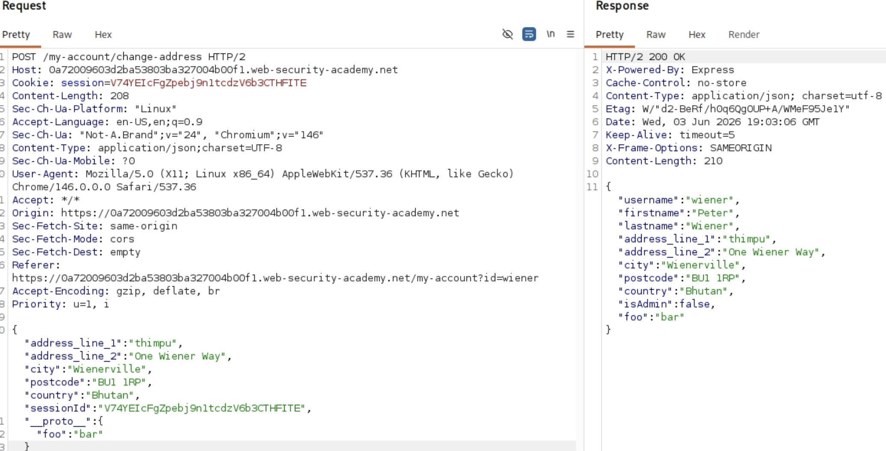

### Figure 3d – Server Response

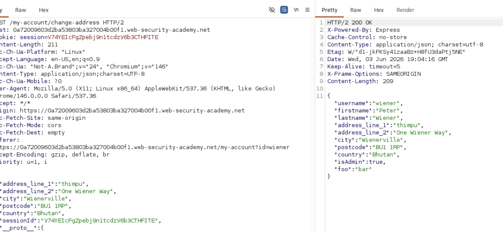

## Step 3 – Solve the Lab

### Figure 3e – Admin Access / Lab Solved

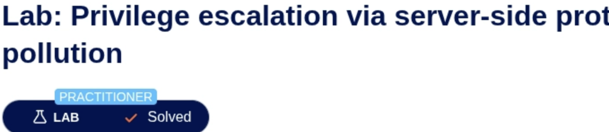

## Summary

The server accepted user-supplied JSON data and merged it into an object without proper validation. By including the `__proto__` property with an `isAdmin` value of `true`, the attack polluted `Object.prototype` on the server. Since all newly created objects inherited this property through the prototype chain, the application treated the user as an administrator and granted elevated privileges.

## Questions – Lab 3

### Question 3.1

Why did the pollution affect all users and requests?

Most Node.js apps operate inside one common JavaScript environment. When someone altered `Object.prototype`, each new object picked up that tainted property automatically. Since the prototype links everything together, all objects down the line carried it forward. That single adjustment rippled through every request handled by the running app.

### Question 3.2

What is the correct code-level fix?

The application should reject dangerous keys such as `__proto__`, `prototype`, and `constructor` before merging user data.

Example:

```javascript
const blocked = ["__proto__", "prototype", "constructor"];

for (const key in userInput) {
    if (blocked.includes(key)) {
        continue;
    }

    target[key] = userInput[key];
}
```

Developers should also consider using:

```javascript
Object.create(null)
```

which creates objects without a prototype chain.


# Lab 4 – Bypassing Flawed Input Filters


## Step 1 – Confirm **proto** Is Blocked

### Figure 4a – Server Blocking **proto**

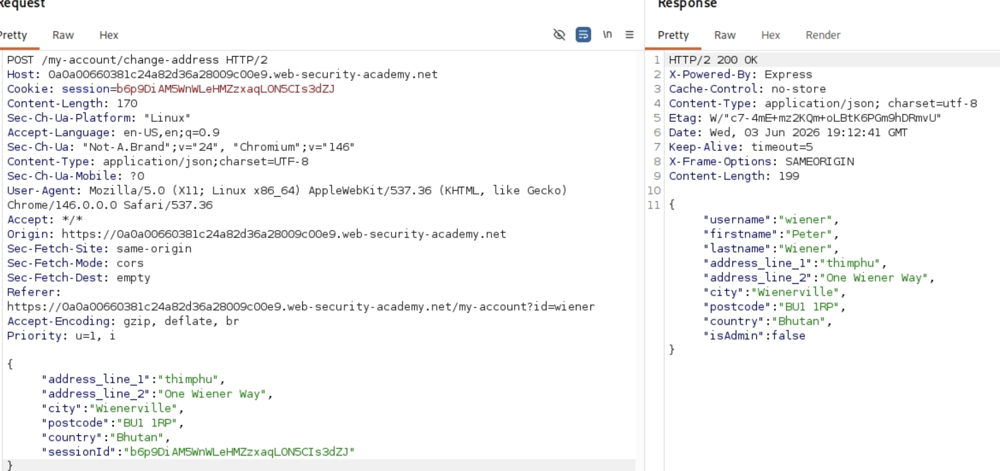

### Server Response

```text
[Insert HTTP status code and error message]
```

## Step 2 – Use constructor.prototype Bypass

### Payload Used

```json
{
  "constructor": {
    "prototype": {
      "isAdmin": true
    }
  }
}
```

### Figure 4b and 4c – Bypass Payload

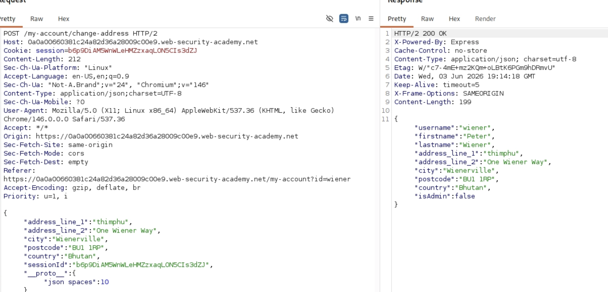

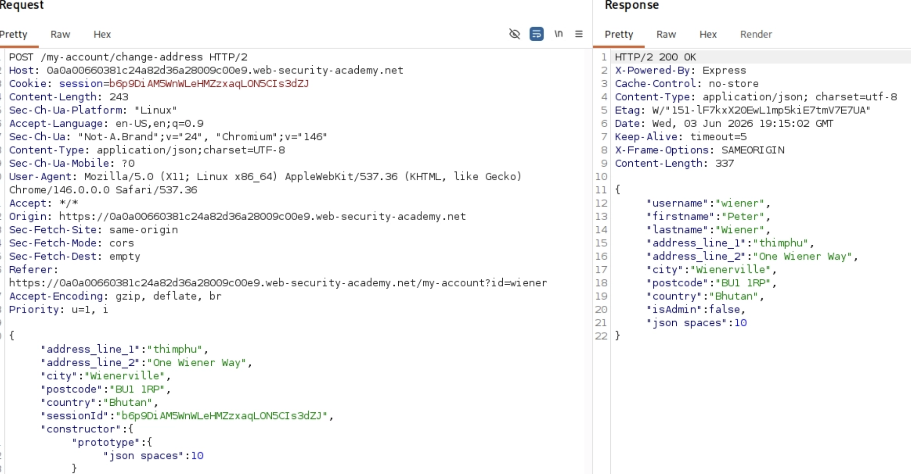

### Figure 4d – Payload Accepted

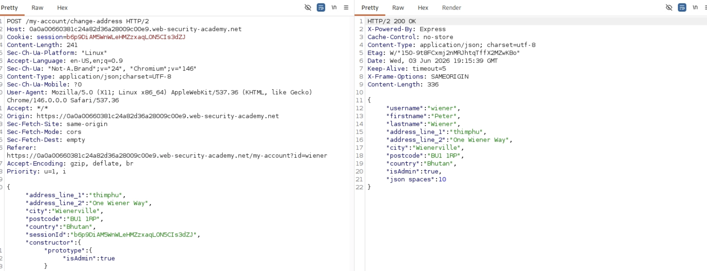

## Step 3 – Solve the Lab

### Figure 4e – Lab Solved Confirmation

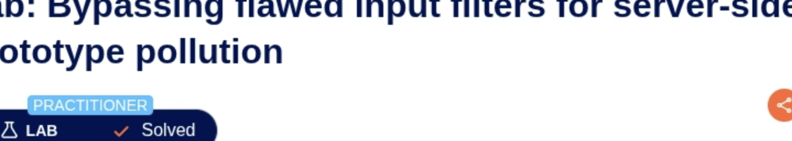


## Summary

The application's protection relied on blocking only the `__proto__` property. However, JavaScript provides another path to the same destination through `constructor.prototype`. By using this alternative path, the attack bypassed the filter and successfully modified `Object.prototype`. This demonstrates that blacklist-based filtering is insufficient for preventing prototype pollution vulnerabilities.


## Questions – Lab 4

### Question 4.1

Why does `constructor.prototype` reach the same object as `__proto__`?

A built-in `constructor` lives inside every JavaScript object, showing which function made it. Most basic objects trace back to `Object` as their maker. The label `Object.prototype` connects directly to a common blueprint also reached through `__proto__`. Changing one route affects the very same core structure behind them both.

### Question 4.2

If the developer also blocks `constructor`, is the application fully protected?

no. True security means thinking ahead. Sometimes hackers find new paths into the prototype chain. Instead of just blocking known tricks, it is better to skip risky merge methods altogether. Picture a system that only accepts clearly approved inputs. Objects built without prototypes can remove whole classes of attacks. Changing properties tied to prototypes? Better say no every time. Designing with safety at the core beats chasing threats endlessly.


